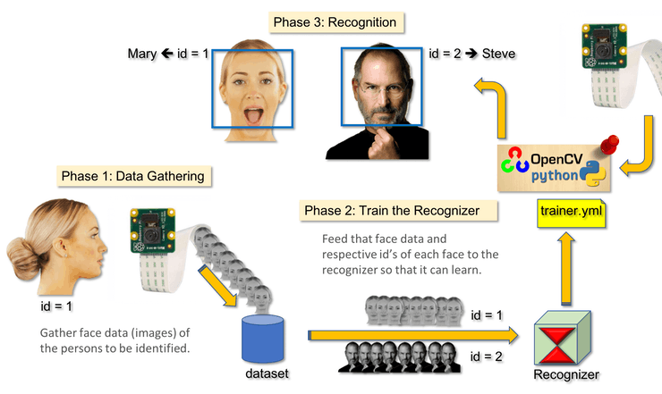
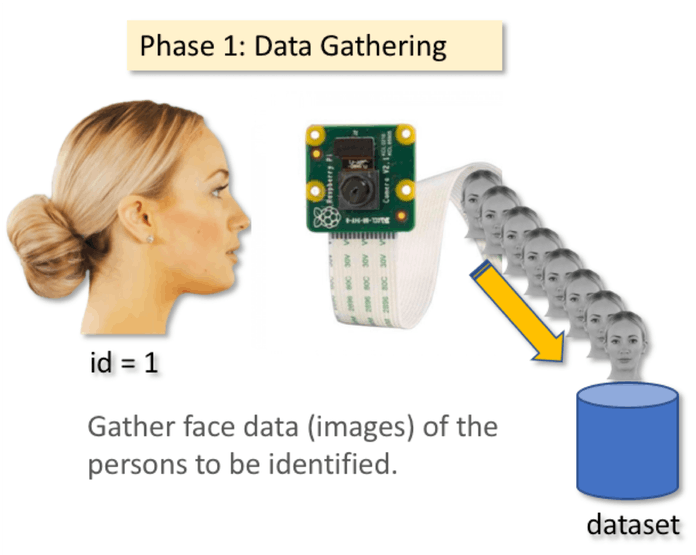
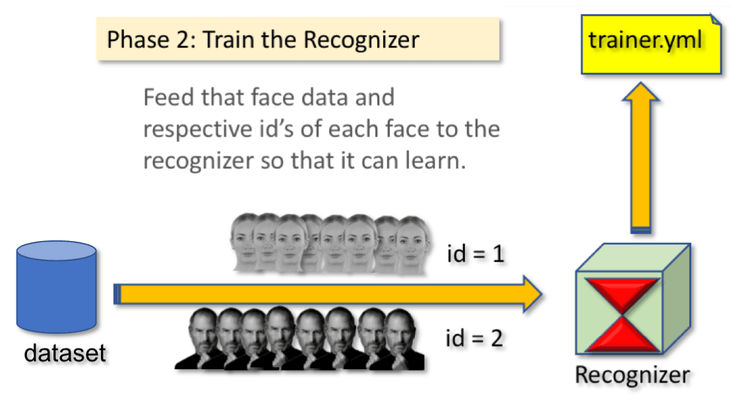
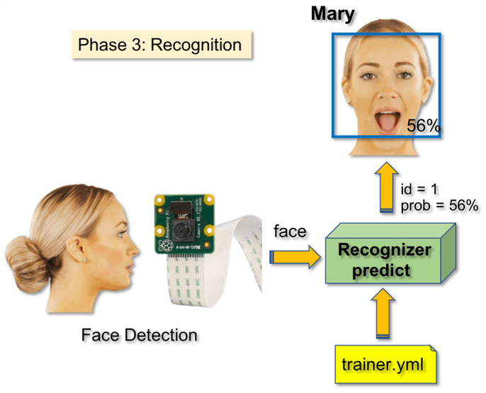

# Face Recognition
In this project, we will create a basic face recognition program using Python and OpenCV
## Objective of The Project
* To recognize the face in the camera and name it.  
* If the face is unknown send a text alert with the image to your mobile via Whatsapp.
## Credits
* Thank You @RamizRaza for great explanation of the face recognition
* Also thanks to @mjrovai for his blog on [real-time face recognition](https://www.hackster.io/mjrobot/real-time-face-recognition-an-end-to-end-project-a10826)

## Hardware needed
* Laptop with inbuilt camera or a webcam
## Software Required
* Python with OpenCV, numpy, os and  pillow libraries installed 
## 4 Phases
 To create the face recognition program, we need to work on 3 different phases which are:
 1. Face detection and gathering data
 2. Training the recognizer
 3. Recognizing the face
 4. If unknown, send a text to your mobile via whatsapp

<fig1>
<figcaption text-align: "center"> Block Diagram of given phases: </figcaption>

  </fig1><br>
  
 ## Installing Libraries
 ### Opencv
 In your command prompt you need to type the following command:
 ```
 pip install opencv_python
 pip install opencv_contrib
 ```
 ### Other libraries
 Other libraries to install are:
 ```
 pip install os
 pip install pillow
 pip install twilio
 pip install cloudinary
 pip install numpy
  ```
 
 You need to create an account on [twilio](https://www.twilio.com/) and on [cloudinary](https://cloudinary.com/)
 
 Now, you can learn about the phases of face recognition on the blog by [Ramiz Raza](https://www.superdatascience.com/blogs/opencv-face-recognition)

Give this a go!!
 Saying that lets move on to **Phase-1** 
 ## Data Gathering
 <fig2>

  </fig2><br>

Run the first python script [face_add.py](face_add.py)


After executing the following program, we will add 50 images of one face to gather enough data to recognize the face.
Run the script few times, each to capture one single id
Make sure to enter the user input id in integers starting from 1, 2 and so on...

We will get to name em later! 
Moving on to **Phase-2** 
## Data Trainer
<fig3>

 </fig3><br>
 
Running the python script [face_trainer.py](face_trainer.py)


Make sure you take the current path of the picture you saved earlier in Data Gathering. 
At the end you should the number of faces trained equal to the faces you captured in [face_add.py](face_add.py)

As a result, a file named "trainer.yml" will be saved in the path you entered.

Note: Everytime you run [face_add.py](face_add.py), you have to run [face_trainer.py](face_trainer.py) also to implement the changes

Now, Lets move on to the phase for Face Recognition, **Phase-3**

## Face Recognizer
<fig4>

 </fig4><br>
 
Now, we have reached the final phase of our project. Here, following steps will be executed: 
1. Capture a fresh face on our camera.  
2. Face captured and trained before wil be recognized. 
3. Recognizer() will make a "prediction" returning its id and an index, showing how confident the recognizer is with this match.
4. Name of the face will be taken from the list **names** which has names indexed according to the userid you added in [face_add.py](face_add.py).
5. Predicted face has a text over it and "probability" in % showing match is correct ("probability" = 100 - confidence index).

Note that the confidence index will return "zero" if it will be cosidered a perfect match.

If the face detetected is not known, move on to **phase-4**

## Unknown Face
<fig1>
<figcaption text-align: "center"> Dealing with unknown face  </figcaption>

  </fig1><br>

THe unknown face has an "unknow" label  above the face and then two steps taken are:

1. Image saved is passed to func uploadimg() in [face_recog.py](face_recog.py).
2. Uploaded image is sent as an MMS using func sendmsg() in [face_recog.py](face_recog.py).
 
Before running the python script, do:

1. Enter your api key, cloud name and api key from the account created in [cloudinary](https://cloudinary.com/) in uploadimg().
2. Enter your authorization id and authorization key from account in [twilio](https://www.twilio.com/). Also, add whatsapp number in sendmsg().

Finally, run the final python script [face_recog.py](face_recog.py) to get the desired result!

Thats it for this project


Thank You 

Vansh

